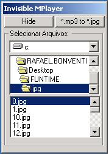



## Invisible MP3 player

### Description

hey all this is a sweet little player that sits on your systray and it plays *.jpg files that are actually *.mp3 files :-)

Reason why:

i have a really harsh boss and he does not like us to listem mp3 while we code, so i made this quick solution

How to:

step1 - copy all of your *.mp3 files to the JPG folder

setp2 - Run mp.exe then push the *.mp3 to *.jpg button this should rename all of your mp3 files

to blah.jpg

setp3 - Now you can listem *.mp3 files that look like *.jpg files, and if the admin comes at your machine

and searches for *.mp3 files guess what he aint going to find anything :-)

setp4 - If you right lick the icon on systray it will close the player imediatelly.

I hope you all can learn from this code and i hope to get some votes for this as well

all developers out there have a nice day and may God Bless us all
 
### More Info
 

             |
---                |---
**Submitted On**   |2002-10-15 10:56:44
**By**             |[Rafael Bonventi](https://github.com/Planet-Source-Code/PSCIndex/blob/master/ByAuthor/rafael-bonventi.md)
**Level**          |Intermediate
**User Rating**    |4.8 (29 globes from 6 users)
**Compatibility**  |VB 6\.0
**Category**       |[Sound/MP3](https://github.com/Planet-Source-Code/PSCIndex/blob/master/ByCategory/sound-mp3__1-45.md)
**World**          |[Visual Basic](https://github.com/Planet-Source-Code/PSCIndex/blob/master/ByWorld/visual-basic.md)
**Archive File**   |[Invisible\_14646910152002\.zip](https://github.com/Planet-Source-Code/rafael-bonventi-invisible-mp3-player__1-39860/archive/master.zip)

